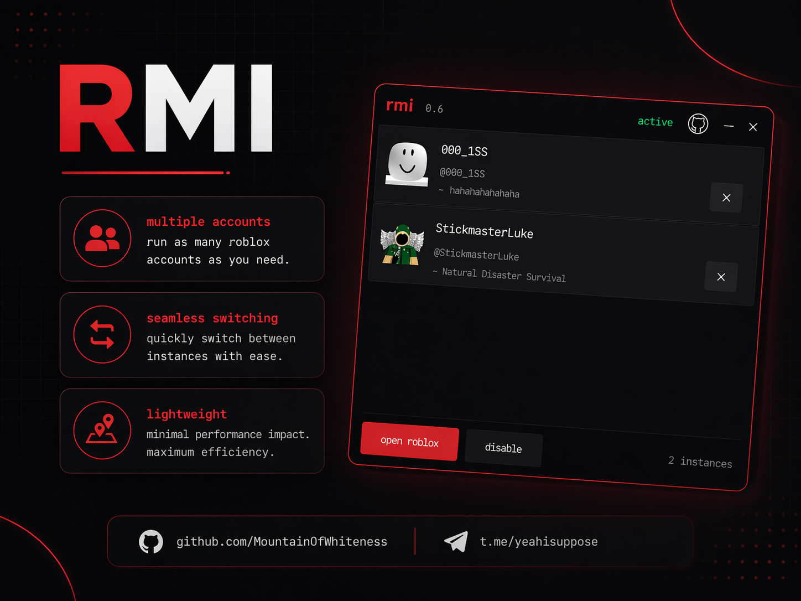

# RMI 0.4

Run multiple Roblox accounts at the same time. Fixes the recent update that broke multi instancing.

## What's new in 0.4
- **New UI** - completely redone with its own UI.
- **Account Tracking** - sees all instances with the game, username shown with avatars now
- **Stable** - rewrote the whole detection system

## Features
- **Easy** - just download and run
- **Lightweight** - super small 
- **Usage** - handles everything for you
- **Windows only**

## How to use
1. Download `rmi.exe` from [releases](https://github.com/MountainOfWhiteness/Roblox-Multi-Instancer/releases)
2. Run it *before* opening Roblox
3. Launch your accounts
4. Done

**Note:** If Roblox is already open when you start RMI, it'll ask you to close roblox.

## Disclaimer
Use at your own risk. I'm not responsible for bans or whatever, though this method is generally safe since it doesn't inject code whatsoever.

## Issues
If it breaks, [make an issue](https://github.com/MountainOfWhiteness/Roblox-Multi-Instancer/issues).

## License
MIT.

Made by MountainOfWhiteness
