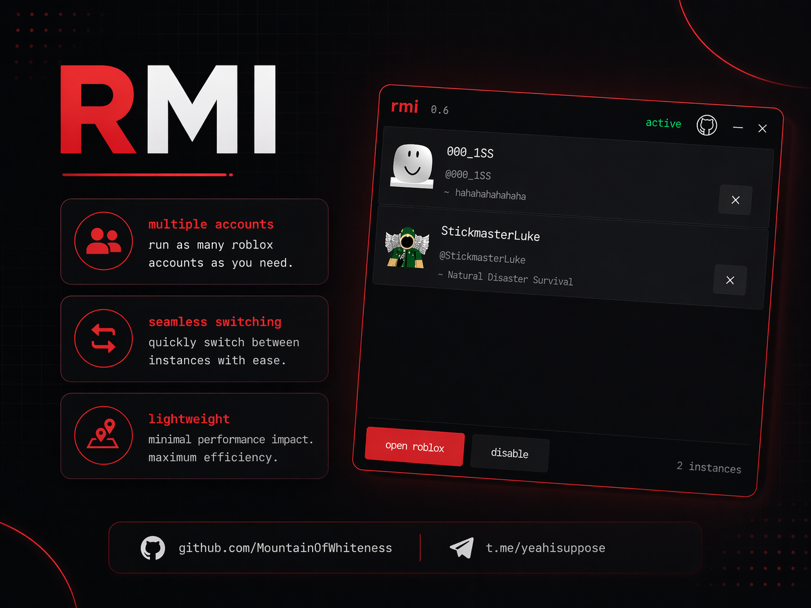

# RMI 0.6

Run multiple Roblox accounts at the same time. This update fixes issues caused by recent Roblox changes that broke multi-instancing again.

## What's new in 0.6

Instance detection has been completely rewritten. Accounts now map correctly and don’t get mixed up between sessions anymore.  
Each instance uses its own log snapshot so old sessions won’t interfere with new ones.  
You can close and reopen accounts without them getting stuck.  
Game detection is more reliable now with place IDs pulled directly from logs and a fallback for the API fails.  

UI has been cleaned up a bit and redone. Instance cards now properly show avatars, usernames, and game names.  
Fixed the minimize button bug where it would flash instead of minimizing.  

Fixed WMI process monitoring crashes in the background and added a fallback to polling if WMI isn’t available.  
Process detection now starts instantly on launch

## Features

Simple to use, just download and run.  
Lightweight and fast.  
Handles everything automatically.  
Windows only sORRY!

## How to use

1. Download `rmi.exe` from [releases](https://github.com/MountainOfWhiteness/Roblox-Multi-Instancer/releases)  
2. Run it before opening Roblox  
3. Launch your accounts  
4. Done  

If Roblox is already open when you start RMI, it will ask you to close it first.

## Disclaimer

Use at your own risk. I am not responsible for bans or any issues that may occur.  
This does not inject anything into Roblox, but you should still use it responsibly.

If you are using bootstrappers like Voidstrap, Bloxstrap, or Fishstrap, you may encounter issues.

## Issues

If something breaks, [make an issue](https://github.com/MountainOfWhiteness/Roblox-Multi-Instancer/issues).

## License

MIT

Made by MountainOfWhiteness
