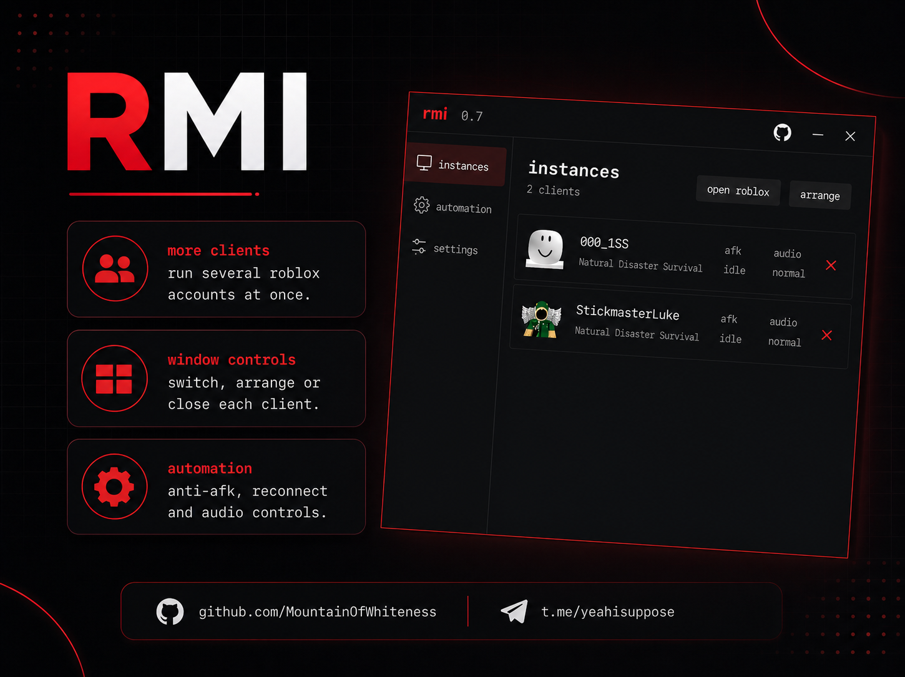

# RMI 0.7

Run multiple Roblox accounts at the same time. RMI 0.7 adds Anti AFK and a few useful controls without changing what the app is for.

## What's new in 0.7

The UI has been rebuilt with separate pages for your clients, automation, and settings.  
The startup screen and tray menu have also been redone to match it.  
Anti-AFK now supports Space, W/S, and Zoom. You can use the same setup for every account or change the method and interval per account.  
The test button only runs on accounts that are switched on.  
Added auto-reconnect for the Roblox reconnect prompt.  
Added automatic muting while Anti-AFK is running, with the old audio state restored when it stops.  
Added window arranging, close to tray, start in tray, and always on top.  
Improved detection when several clients open close together.  
Accounts and games are matched from separate log snapshots so old sessions are less likely to get mixed into new ones.  
Fixed the standalone build missing Tkinter.  

## Features

Simple to use, just download and run.  
AntiAFK controls for each account.  
Auto reconnect and audio controls.  
Arrange your Roblox windows into a grid.  
Tray controls and saved settings.  
Windows only sORRY!

## How to use

1. Download `rmi.exe` from [releases](https://github.com/MountainOfWhiteness/Roblox-Multi-Instancer/releases)  
2. Run it before opening Roblox  
3. Launch your accounts  
4. Turn on any automation you want  

If Roblox is already open when you start RMI, it will ask before closing the current clients.

## Disclaimer

Use at your own risk. I am not responsible for bans or any issues that may occur.  
This does not inject anything into Roblox, but you should still use it responsibly.

If you are using bootstrappers like Voidstrap, Bloxstrap, or Fishstrap, you may encounter issues.

## Issues

If something breaks, [make an issue](https://github.com/MountainOfWhiteness/Roblox-Multi-Instancer/issues).

## License

MIT

Made by MountainOfWhiteness
